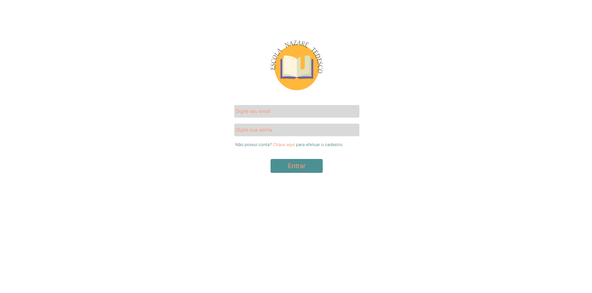
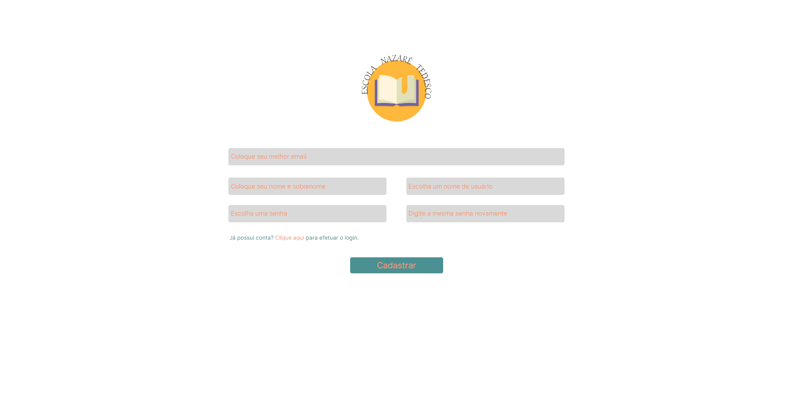

# Projeto Escola Nazaré Tedesco

> Projeto independente

Um projeto feito a partir de um modelo no Figma.

[🔗 Clique aqui para acessar](https://giosmartyn.github.io/Projeto_Estudo_02/)

## ⚒️ Tecnologias
HTML
CSS
Git e Github

## 💜 Contato
giovanna.martyn@gmail.com